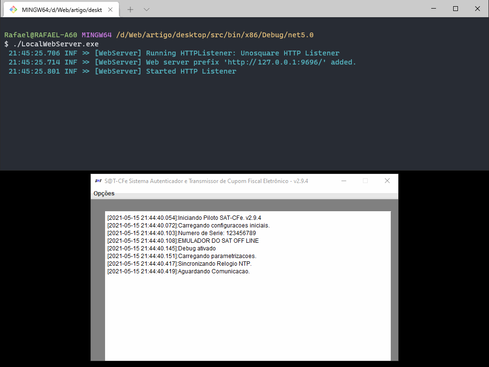
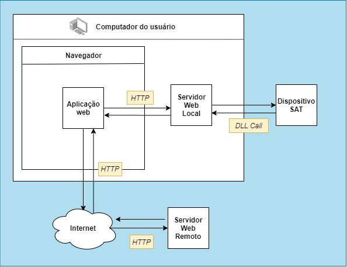

# Integrando aplicação web com dispositivo local

Demonstração de como fazer a comunicação entre uma aplicação web e um dispositivo local (utilizando como exemplo um dispositivo SAT), através de uma aplicação desktop que funciona como um servidor web local e faz a ponte entre a aplicação web e o dispositivo local.

## Fluxo de comunicação

1. A aplicação web se comunica com a aplicação desktop através do protocolo HTTP;
2. A aplicação desktop se comunica com o dispositivo SAT através da DLL e retorna os dados para a aplicação web através do protocolo HTTP;
3. A aplicação web pode então enviar os dados retornados para o servidor web remoto através do protocolo HTTP.

## Emulador SAT

Antes de qualquer coisa é necessário baixar (através [deste link](https://portal.fazenda.sp.gov.br/servicos/sat/Downloads/emulador_off_line_v2_9_4.zip)), instalar e rodar o emulador do SAT disponibilizado pela Receita Federal.

## Aplicação desktop

A aplicação desktop foi escrita em C#, utilizando a biblioteca [EmbedIO](https://github.com/unosquare/embedio) para criar o servidor web local.

### Requisitos

- Windows
- .NET 5.0

### Uso

- Editar o arquivo [LocalWebServer.dll.config](desktop/dist/windows/x86/LocalWebServer.dll.config) e definir a porta que será utilizada e o endereço base da aplicação web; 
- Executar o arquivo [LocalWebServer.exe](desktop/dist/windows/x86/LocalWebServer.exe) e deixá-lo em execução.

### Projeto

Se deseja fazer alterações no projeto, basta utilizar o Microsoft Visual Studio 2019 e abrir o projeto em [src](desktop/src).

## Aplicação web

A aplicação web é uma página simples, utilizando HTML, CSS (Bootstrap) e Javascript (Vue.JS e axios).

### Requisitos

- Servidor web (Apache, Nginx, etc.)
- Navegador com suporte à ES6

### Uso

Basta acessar o arquivo [index.html](web/index.html) em algum servidor web. Se preferir, você também pode acessar a aplicação web através [deste link](https://artigos74.rafaelcouto.com.br/integrando-aplicacao-web-com-dispositivo-local/).

## Mais informações

[https://rafaelcouto.com.br/integrando-aplicacao-web-com-dispositivo-local](https://rafaelcouto.com.br/integrando-aplicacao-web-com-dispositivo-local)
